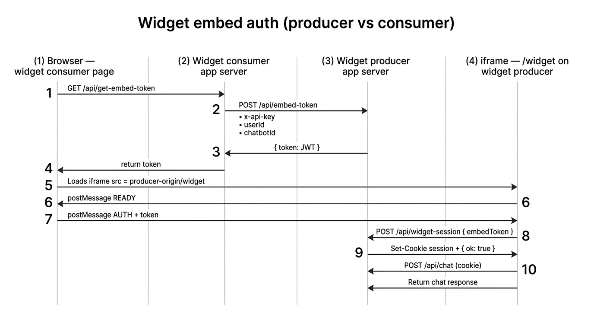

# iframe-auth

This folder is a small technical demo of how an embeddable chat widget can authenticate inside a cross-origin iframe without exposing long-lived credentials to the browser.

## Repository layout

| Folder | Role |
| --- | --- |
| **`widget-producer-app/`** | **Widget producer app** — hosts the iframe UI (`/widget`), issues short-lived embed tokens, stores sessions in SQLite, exposes `/api/embed-token`, `/api/widget-session`, `/api/chat`. |
| **`widget-consumer-app/`** | **Widget consumer app** — a site that embeds the producer’s iframe; keeps the producer API key on its server and proxies `GET /api/get-embed-token` to the producer. |

The browser loads the consumer page, which embeds an iframe from the producer origin. Two folders ⇒ two origins in local dev (`localhost:3000` vs `localhost:3001`).

> **Note:** Older copies named `widget-app/` and `customer-app/` may still appear if a process had those directories open. When nothing is using them, you can delete those legacy folders so only `widget-producer-app` and `widget-consumer-app` remain.

## Architecture overview



## What this demo is proving

The interesting part is not rendering an iframe. The hard part is getting auth into that iframe without:

- putting secrets in the URL
- giving the browser a reusable producer API key
- trusting stale authorization state
- relying on frontend-only checks

This demo uses a two-step credential model:

1. The widget consumer app backend authenticates to the widget producer app with an API key.
2. The widget producer app returns a short-lived embed token.
3. The browser passes that token into the iframe with `postMessage`.
4. The iframe exchanges the token for a producer-managed session cookie.
5. Later chat requests use the cookie, not the token.

That keeps the producer API key on the consumer server and keeps the short-lived token out of the iframe URL.

## Actors

| Actor | Responsibility |
| --- | --- |
| Widget producer app (`widget-producer-app`) | Owns the chat product, issues embed tokens, verifies ownership, creates sessions, and serves the iframe UI |
| Widget consumer app (`widget-consumer-app`) | Embeds the producer iframe and requests embed tokens from its own backend using a producer API key |
| End user (browser) | Loads the widget consumer app page, hosts the iframe, and carries the widget session cookie (for the producer origin) |

## End-to-end flow

1. The browser on the widget consumer app page calls `widget-consumer-app/api/get-embed-token`.
2. That route makes a backend-to-backend request to `widget-producer-app/api/embed-token` with `x-api-key`.
3. The widget producer app verifies the API key, verifies the requested chatbot belongs to that consumer tenant, and signs a JWT with a 60-second TTL.
4. The widget consumer app page renders the iframe.
5. The iframe loads `widget-producer-app/widget` and sends `READY` to the parent window.
6. The parent responds with `AUTH` and includes the embed token in a `postMessage`.
7. The iframe posts the token to `widget-producer-app/api/widget-session`.
8. The widget producer app verifies the JWT, re-checks chatbot ownership in the database, creates a session row, and sets an HttpOnly cookie.
9. `widget-producer-app/api/chat` authenticates later requests by reading that cookie and loading the associated session.

## Why the flow is split this way

### Why not put the token in the iframe URL?

Putting a token in `src="/widget?token=..."` makes it easier to leak through:

- browser history
- access logs
- copy/paste of the address
- referrer handling in adjacent requests

`postMessage` keeps the token in memory and limits delivery with an explicit `targetOrigin`.

### Why exchange the JWT for a cookie-backed session?

The embed token is just a bootstrap credential. It proves the widget consumer app backend recently authorized this user-chatbot pair. After that, the widget producer app switches to a normal server-side session because it is easier to expire, revoke, inspect, and evolve than repeatedly trusting a browser-held token.

### Why re-check chatbot ownership after verifying the JWT?

JWT verification only proves the token was valid when it was signed. It does not prove the underlying database relationship is still valid right now. Re-checking `chatbot.customerId` prevents a token from surviving a later reassignment or deletion.

## Security choices shown here

| Decision | Reason |
| --- | --- |
| Consumer API key usage is server-to-server only | The browser never receives producer credentials |
| Embed token expires quickly | Limits replay value if intercepted |
| `postMessage` checks `origin` and uses `targetOrigin` | Prevents broad message delivery across windows |
| Session cookie is `HttpOnly` | Frontend code cannot read or exfiltrate it directly |
| `SameSite=None; Secure` in production | Required for cross-site iframe cookie behavior |
| Development falls back to `SameSite=Lax` on plain HTTP | Browsers reject `SameSite=None` without `Secure` on localhost |
| Session lookup checks expiry in the database | Expired cookies do not remain valid just because the browser still has them |

## Environment variables (local)

**Widget producer** (`widget-producer-app/.env.local`): `EMBED_SECRET`, `YOURCHAT_API_KEY`, `ALLOWED_EMBED_ORIGINS`, `NEXT_PUBLIC_CONSUMER_APP_ORIGIN` (origin of the consumer app for `postMessage` checks). The widget page still accepts legacy `NEXT_PUBLIC_CUSTOMER_ORIGIN` if you have not migrated yet.

**Widget consumer** (`widget-consumer-app/.env.local`): `YOURCHAT_API_KEY`, `CHATBOT_ID`, `NEXT_PUBLIC_WIDGET_ORIGIN`.

## Local development

```bash
# Terminal 1 — widget producer (default port 3000)
cd widget-producer-app
npm run dev

# Terminal 2 — widget consumer (port 3001)
cd widget-consumer-app
npm run dev
```

Open `http://localhost:3001`.

## Cookie behavior on localhost

Production iframe cookies normally need `SameSite=None` and `Secure`, which means HTTPS. That combination does not work on plain `http://localhost`, so this demo relaxes the cookie policy in development to keep the flow testable.

That is useful for learning, but it is not a production deployment model. If you want to test browser behavior closer to production, run both apps over local HTTPS with a tool such as [`mkcert`](https://github.com/FiloSottile/mkcert).

## Data model

The widget producer app uses Prisma with SQLite in `widget-producer-app/prisma/dev.db`.

Important records:

- `Customer`: represents the widget consumer tenant and stores its producer API key
- `Chatbot`: belongs to a customer
- `Session`: binds a user and chatbot to a producer-managed session id

Useful commands:

```bash
cd widget-producer-app

npx prisma migrate reset
YOURCHAT_API_KEY=sk-dev-api-key-change-in-production npx prisma db seed
npx prisma studio
```

## Current limitations

This project is intentionally small, so a few parts are still simplified:

- `/api/chat` returns a placeholder response instead of calling a model
- the widget consumer app uses a hardcoded demo `userId`
- tenant configuration is still environment-based
- there is no session revocation or rotation flow yet

## Next improvements

The most interesting next step is to connect `/api/chat` to an LLM and scope retrieval with `session.chatbot` so each bot can answer questions specifically about the site owner that embedded it.

That could be extended further with:

- indexing customer help-center pages or product docs
- tenant-specific prompt and tool configuration
- per-customer rate limits and audit logs
- richer session lifecycle controls such as revocation and idle expiry
